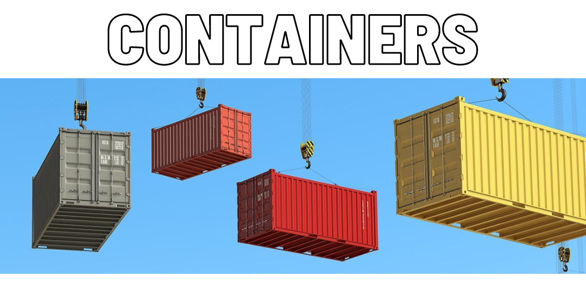

# Containers

Используемые технологии: C++, Makefile, библиотека gtest (unit-тесты)

Самостоятельная реализация стандартной библиотеки шаблонов C++ (STL)

* Реализованы классы: `list`, `map`, `queue`, `set`, `stack`, `vector`, `array`, `multiset`;

* Некоторые классы дополнены функциями в соответствии с таблицей:

  | Modifiers                                                  | Definition                                             | Containers          |
  | ---------------------------------------------------------- | ------------------------------------------------------ | ------------------- |
  | `iterator emplace(const_iterator pos, Args&&... args)`     | Вставляет новые элементы в контейнер сразу перед `pos` | List, Vector        |
  | `void emplace_back(Args&&... args)`                        | Добавляет новые элементы к концу контейнера            | List, Vector, Queue |
  | `void emplace_front(Args&&... args)`                       | Добавляет новые элементы к началу контейнера           | List, Stack         |
  | `vector<std::pair<iterator,bool>> emplace(Args&&... args)` | Вставляет новые элементы в контейнер                   | Map, Set, Multiset  |

## Сборка

* Для использования библиотеки достаточно включить заголовочный файл `s21_container.h` в исходный код;
* Для запуска unit-тестов нужно выполнить цель `make test`
